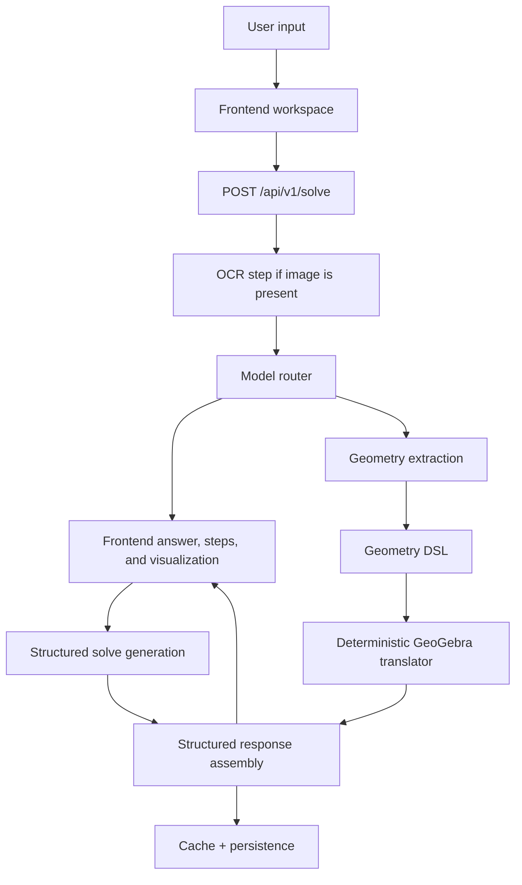

# IntoMath 2.0 Architecture

## Design goals

IntoMath is designed as a visual learning product, not a chatbot wrapper.

Core architectural goals:

1. **Structured outputs over free-form prose**
2. **Deterministic visualization generation**
3. **Configurable model routing**
4. **Focused solver UX**
5. **Fast feedback with caching and useful deterministic local solving**

## System overview



## Frontend architecture

### App Router structure

- `frontend/app/(marketing)`
  - landing experience
- `frontend/app/(dashboard)`
  - focused solver shell
  - solve page
  - unfinished legacy dashboard routes redirect to the solver

### Key frontend modules

- `components/marketing/landing-page.tsx`
  - focused product homepage
- `components/dashboard/solve-workspace.tsx`
  - two-column solver workspace
- `components/visualization/geogebra-applet.tsx`
  - lazy GeoGebra loader + command execution
- `features/solver/hooks/use-solve-problem.ts`
  - React Query mutation for solve requests
- `stores/solve-workspace.ts`
  - Zustand state for prompt, upload payload, and learning mode
- `lib/api-client.ts`
  - frontend API transport helper

### UX principles implemented

- solver-first rather than chat-first
- honest capability language rather than AI-brand theatrics
- solution steps split into digestible cards
- confidence shown lightly without routing clutter
- visualization loaded lazily to protect initial performance

## Backend architecture

### API layer

- `app/main.py`
  - FastAPI app setup
  - CORS middleware
  - startup table creation
- `app/api/v1/endpoints/solve.py`
  - `POST /api/v1/solve`
- `app/api/v1/endpoints/health.py`
  - health endpoint

### Service layer

- `solver_service.py`
  - main orchestration layer
  - OCR
  - routing
  - solving
  - visualization extraction
  - translation
  - persistence
  - response caching
- `model_router.py`
  - configurable routing heuristics
- `local_solver_selector.py`
  - tries deterministic solving first and optionally uses a tiny local llama.cpp model to normalize supported prompts
- `ocr_service.py`
  - image-to-structured-text stage through OpenRouter vision
- `geometry_extractor.py`
  - DSL extraction via LLM for geometry-heavy problems, heuristic fallback otherwise
- `geogebra_translator.py`
  - deterministic DSL → GeoGebra translation
- `fallback_solver.py`
  - deterministic local solving for supported prompts, used before model-backed solving when it returns a high-confidence result
- `cache.py`
  - in-memory TTL response cache

## Routing architecture

The router currently classifies problems by keyword and shape heuristics into:

- `arithmetic`
- `algebra`
- `geometry`
- `coordinate_geometry`
- `trigonometry`
- `calculus`
- `statistics`
- `probability`
- `functions`
- `general`

Difficulty is then assessed separately:
- proof keywords → hard
- multi-point geometry → hard
- proof-style calculus → hard
- longer, denser prompts → medium or hard
- straightforward arithmetic / algebra → easy

### Model policy

| Use case | Model / route |
|---|---|
| Supported arithmetic, linear equations, quadratic graphs, simple constructions | `local:deterministic-solver` |
| Optional local-solver detection / normalization | `hf.co/unsloth/LiquidAI/LFM2.5-350M-GGUF` (reasoning enabled) via Llama-server |
| Easy algebra / arithmetic outside deterministic coverage | `nvidia/nemotron-3-nano-30b-a3b:free` via OpenRouter |
| Hard geometry / proofs / multi-step reasoning | `nvidia/nemotron-3-super-120b-a12b:free` via OpenRouter |
| OCR / image extraction | `deepseek-ai/deepseek-ocr-2` locally |

## Geometry DSL

The DSL schema is defined in `backend/app/schemas/geometry_dsl.py`.

### Example

```json
{
  "version": "1.0",
  "space": "euclidean_2d",
  "actions": [
    {
      "action": "CREATE_POINT",
      "label": "A",
      "coordinates": [0, 0]
    },
    {
      "action": "CREATE_POINT",
      "label": "B",
      "coordinates": [4, 0]
    },
    {
      "action": "CREATE_LINE",
      "label": "l1",
      "points": ["A", "B"]
    }
  ],
  "render_hints": {}
}
```

### Supported actions

- `CREATE_POINT`
- `CREATE_LINE`
- `CREATE_CIRCLE`
- `CREATE_POLYGON`
- `INTERSECT`
- `MIDPOINT`
- `PERPENDICULAR`
- `PARALLEL`
- `ANGLE_BISECTOR`
- `CREATE_FUNCTION`

## Deterministic GeoGebra translation

The translator never asks the model for raw command strings.

Instead it:
1. reads structured DSL actions
2. emits known command templates
3. validates command names against `backend/geogebra_commands.json`
4. returns both individual commands and a concatenated command string

This provides a clear boundary between:
- model intent
- executable visualization commands

## Persistence layer

SQLAlchemy models:

### `problem_attempts`
Stores:
- raw text
- normalized text
- input type
- language
- created timestamp

### `solver_runs`
Stores:
- selected parser / solver / vision models
- problem type
- difficulty
- route reason
- confidence
- cache status
- response status

### `visualization_artifacts`
Stores:
- visualization kind
- DSL JSON
- command JSON
- visualization summary

## Caching

`SolverService` uses a TTL cache keyed by normalized text + request options.

Benefits:
- repeat queries return faster
- repeated local/model solves return faster
- model usage can be reduced for repeated prompts

## Failure strategy

If OpenRouter is unavailable or no API key is configured:
- supported typed problems still solve through deterministic local logic
- unsupported prompts return a clear limitation message
- warnings are surfaced in the structured response

This keeps the product useful locally without pretending unsupported prompts were solved.
