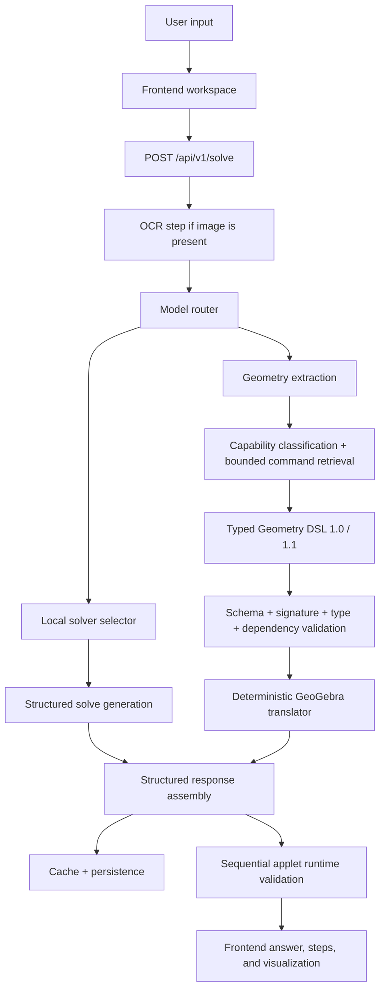

# IntoMath 2.0 Architecture

## Design goals

IntoMath is designed as a visual learning product, not a chatbot wrapper.

Core architectural goals:

1. **Structured outputs over free-form prose**
2. **Deterministic visualization generation**
3. **Configurable model routing**
4. **Focused solver UX**
5. **Fast feedback with caching and useful deterministic local solving**

## System overview


```mermaid
flowchart TD
    A[User input] --> B[Frontend workspace]
    B --> C[POST /api/v1/solve]
    C --> D[OCR step if image is present]
    D --> E[Model router]
    E --> L[Local solver selector]
    L --> F[Structured solve generation]
    E --> G[Geometry extraction]
    G --> H[Capability classification + bounded command retrieval]
    H --> I[Typed Geometry DSL 1.0 / 1.1]
    I --> V[Schema + signature + type + dependency validation]
    V --> T[Deterministic GeoGebra translator]
    F --> J[Structured response assembly]
    T --> J
    J --> K[Cache + persistence]
    J --> R[Sequential applet runtime validation]
    R --> U[Frontend answer, steps, and visualization]
```

## Frontend architecture

### App Router structure

- `frontend/app/(marketing)`
  - landing experience
- `frontend/app/(dashboard)`
  - focused solver shell
  - solve page
  - unfinished legacy dashboard routes redirect to the solver

### Key frontend modules

- `components/marketing/landing-page.tsx`
  - focused product homepage
- `components/dashboard/solve-workspace.tsx`
  - two-column solver workspace
- `components/visualization/geogebra-applet.tsx`
  - lazy GeoGebra loader + per-command execution/error UI
- `components/visualization/geogebra-runtime.ts`
  - testable sequential execution, rollback, perspective, style, viewport, and interaction operations
- `features/solver/hooks/use-solve-problem.ts`
  - React Query mutation for solve requests
- `stores/solve-workspace.ts`
  - Zustand state for prompt, upload payload, and learning mode
- `lib/api-client.ts`
  - frontend API transport helper

### UX principles implemented

- solver-first rather than chat-first
- honest capability language rather than AI-brand theatrics
- solution steps split into digestible cards
- confidence shown lightly without routing clutter
- visualization loaded lazily to protect initial performance

## Backend architecture

### API layer

- `app/main.py`
  - FastAPI app setup
  - CORS middleware
  - startup table creation
- `app/api/v1/endpoints/solve.py`
  - `POST /api/v1/solve`
- `app/api/v1/endpoints/health.py`
  - health endpoint

### Service layer

- `solver_service.py`
  - main orchestration layer
  - OCR
  - routing
  - solving
  - visualization extraction
  - translation
  - persistence
  - response caching
- `model_router.py`
  - configurable routing heuristics
- `local_solver_selector.py`
  - tries deterministic solving first and optionally uses the local llama.cpp model to normalize supported prompts
- `ocr_service.py`
  - image-to-structured-text stage through local DeepSeek OCR
- `geometry_extractor.py`
  - validated, schema-constrained DSL extraction through the local llama.cpp model for local solve routes
  - remote model extraction for model-backed geometry routes
  - small deterministic fallback for unavailable, semantically mismatched, or invalid model output
- `geogebra_translator.py`
  - deterministic DSL → GeoGebra translation
- `geogebra_command_registry.py`
  - cached overload registry, progressive signature normalization, capability mapping, and keyword retrieval
- `geogebra_validator.py`
  - label/type/environment/allowlist/dependency validation and topological ordering
- `fallback_solver.py`
  - deterministic local solving for supported prompts, used before model-backed solving when it returns a high-confidence result
- `cache.py`
  - in-memory TTL response cache

## Routing architecture

The router currently classifies problems by keyword and shape heuristics into:

- `arithmetic`
- `algebra`
- `number_theory`
- `geometry`
- `coordinate_geometry`
- `trigonometry`
- `calculus`
- `statistics`
- `probability`
- `functions`
- `general`

Difficulty is then assessed separately:
- proof keywords → hard
- multi-point geometry → hard
- proof-style calculus → hard
- longer, denser prompts → medium or hard
- straightforward arithmetic / algebra → easy

### Model policy

| Use case | Model / route |
|---|---|
| Supported arithmetic, linear equations, quadratic graphs, simple constructions | `local:deterministic-solver` |
| Local routing, normalization, trivia, and schema-constrained visualization extraction | `unsloth/LFM2.5-8B-A1B-GGUF` (`UD-Q4_K_XL`) via llama-server; deterministic validation/fallback remains authoritative |
| Easy algebra / arithmetic outside deterministic coverage | `nvidia/nemotron-3-nano-30b-a3b` via NVIDIA NIM |
| Hard geometry / proofs / multi-step reasoning | `nvidia/nemotron-3-super-120b-a12b` via NVIDIA NIM |
| Model fallback | NVIDIA NIM order: Nemotron Super → gpt-oss-120b → Nemotron Nano → gpt-oss-20b, with bounded family-specific reasoning and deterministic post-validation |
| OCR / image extraction | `deepseek-ai/deepseek-ocr-2` locally |

Structured-solve fallback order is explicit: the preferred and alternate NVIDIA
Nemotron models, then NVIDIA NIM gpt-oss-120b and gpt-oss-20b. Geometry uses the same
entries after the local llama safety net.

## GeoGebra trust boundary

The production flow is:

```text
prompt
→ capability classification
→ `none` returns without retrieval or model extraction
→ bounded catalog retrieval
→ model emits typed DSL
→ Pydantic schema validation
→ retrieved-command/signature/type/environment validation
→ at most one action-scoped remote repair and full re-validation
→ dependency graph + stable topological ordering
→ deterministic backend translation
→ sequential frontend evalCommand validation
→ interactive rendering
```

The model describes intent. It does not emit construction strings, scripts, or
JavaScript. The backend is the only component that creates GeoGebra command
syntax. Applet styling and view changes are separate typed API calls.

Capability classification is driven by structures stated in the problem, not by the
router's broad problem type or numeric tuples that appear only in a solved answer.
The validator separately rejects point-only plans whose coordinates merely reproduce
answer tuples absent from the normalized problem statement.

Remote solve and geometry requests include strict response schemas in their prompts and
validate responses locally. Provider/schema unavailability is distinct from invalid
model output. Geometry falls through to the constrained local parser, the explicitly
named NVIDIA NIM models, and finally the limited deterministic construction parser. The
published closed NVIDIA `ChatRequest` schemas for these models omit `response_format`,
so non-streaming output is explicitly treated as an unenforced proposal. Nemotron
thinking is disabled; gpt-oss uses low reasoning effort. The same authoritative payload,
semantic, dependency, type, and allowlist validators run for every provider.

## Geometry DSL versions

The DSL schema is defined in `backend/app/schemas/geometry_dsl.py`.

### Example

```json
{
  "version": "1.1",
  "space": "euclidean_2d",
  "environment": "geometry_2d",
  "actions": [
    {
      "action": "CREATE_POINT",
      "label": "A",
      "coordinates": [0, 0]
    },
    {
      "action": "CREATE_POINT",
      "label": "B",
      "coordinates": [4, 0]
    },
    {
      "action": "EXECUTE_COMMAND",
      "output": "l1",
      "command": "Line",
      "arguments": [
        {"kind": "reference", "value": "A"},
        {"kind": "reference", "value": "B"}
      ]
    }
  ],
  "render_hints": {}
}
```

### Supported actions

- `CREATE_POINT`
- `CREATE_LINE`
- `CREATE_CIRCLE`
- `CREATE_POLYGON`
- `INTERSECT`
- `MIDPOINT`
- `PERPENDICULAR`
- `PARALLEL`
- `ANGLE_BISECTOR`
- `CREATE_FUNCTION`
- `EXECUTE_COMMAND`

DSL `1.0` remains accepted and uses the existing high-level action fields.
`EXECUTE_COMMAND` requires `1.1`; its output label is deliberately distinct
from command arguments and from `label` on high-level actions. Generic commands
may omit `output` only for a terminal result that will not be referenced later.
The validator emits `untracked_output` as a warning, and GeoGebra may assign its
own label.

Typed generic arguments are `reference`, `number`, `angle`, `point`, `vector`,
`text`, `boolean`, `expression`, `equation`, `list`, and `interval`. Every kind
has a deterministic serializer. Expressions use a small mathematical grammar;
object dependencies must use `reference`, not identifiers hidden inside an
expression.

### Environments and perspectives

The schema represents `geometry_2d`, `graphing`, `graphics_3d`, `cas`,
`probability`, `statistics`, and `spreadsheet`. The frontend uses the documented
GeoGebra Classic standard perspectives: geometry `2`, algebra/graphics `1`,
spreadsheet `3`, CAS `4`, 3D `5`, and probability/statistics `6`.

This is a capability model, not a universal-support claim. The production
generic-command rollout currently admits only the reviewed core 2D command
set. `CREATE_FUNCTION` continues to support the existing deterministic graphing
path. Other environments are classified, indexed, and perspective-aware but
remain gated until their command families have typed and runtime coverage.

## Command registry and discovery

`backend/geogebra_commands.json` contains 502 names and 1,052 overloads from a
pinned upstream commit. The registry:

1. groups duplicate command entries and overloads case-insensitively;
2. retains original signatures and marks uncertain normalization;
3. extracts bounded counts, variadic markers, approximate types, categories,
   CAS and special-environment requirements;
4. marks scripting/state/media commands unsafe;
5. searches exact names, justified aliases, categories, descriptions, and
   prompt keywords; and
6. returns at most 20 names (the extractor currently requests 10 and then
   applies the rollout gate).

Only retrieved commands plus a small global core may be emitted. A cataloged
command outside that boundary receives `command_not_retrieved` or
`command_family_not_rolled_out`. Debug solve responses include the bounded name,
score, and signatures only when `APP_DEBUG=true`; full prompts are never
returned.

GeoGebra command definitions are derived from the official manual. The manual
is not vendored here:
https://github.com/geogebra/manual/tree/main/en/modules/ROOT/pages/commands

The generator consumes an explicit local checkout or performs an explicit
developer-requested Git fetch. Normal startup, tests, and requests are offline
with respect to the manual.

## Semantic validation and deterministic translation

The validator tracks Point, Line, Segment, Ray, Circle, Conic, Polygon,
Function, Number, Angle, List, Vector, Matrix, Text, Plane, Surface, Solid, and
Unknown. It rejects undefined references, duplicates, cycles, known type/count
mismatches, unsupported environments, unsafe commands, and model-selected
commands outside retrieval. Independent out-of-order actions are sorted before
translation. Uncertain documentation is accepted only where a compatible,
normalized overload provides a safe match.

Validation returns structured issues containing a code, original action index,
command, output label, severity, and message. Any error produces no command
list; SolverService still returns the mathematical solution with warnings.

The serializer formats finite numbers, degree/radian angles, 2D/3D points and
vectors, escaped text, lowercase booleans, equations, bounded recursive lists,
and intervals. It never uses Python `eval` and never interpolates an unchecked
label, command, text, or expression.

## Runtime validation and rendering operations

The frontend calls `evalCommand` once per command and requires a `true` result.
It stops at the first `false`/exception, records the zero-based backend index
and human-facing one-based index, and restores the XML snapshot. If snapshot
restore is unavailable it starts a fresh construction. A failed construction is
never marked ready; retry remounts the applet.

Color, line thickness/style, point size, label/object visibility, fixation, and
caption use structured applet API methods. Coordinate bounds, axes/grid state,
perspective, movable points, and predefined animation state are also API calls.
`useBrowserForJS` is false. No model-generated JavaScript is evaluated.

## Option B: raw command output

Raw model-generated GeoGebra commands are not implemented or enabled. Typed
generic DSL is the production recommendation because it supports signature,
type, dependency, environment, and targeted repair errors before execution.

A future trusted-user/debug experiment would have to be disabled by default;
limit count and length; reject newlines/separators; validate English command
names against the registry; reject scripts, JavaScript, and incompatible
environments; execute one command at a time; and inspect every boolean runtime
result. It must not become the ordinary AI path.

## Security limits

- 40 actions, 16 arguments per command, 32 items per list, nesting depth 3
- 32-character conservative labels and 64-character command names
- finite numbers and coordinates bounded to ±1e9
- expression/equation length 200; text length 500; caption length 120
- newline, semicolon, quote/expression-command, JavaScript URL, and command-name injection rejection
- repeated labels, missing references, cycles, and 2D/3D coordinate mismatch rejection
- explicit deny policy for scripting, command-text execution, destructive state, media/URL, and catalog state-setting commands

## Command-family rollout

The reviewed production slice is core 2D geometry plus the existing
deterministic function action. Transformations and common measurements are in
the core generic set and have registry/serializer validation tests, but browser
runtime behavior is still checked at execution time.

For each next family: add capability mappings, fixture signatures and types,
retrieval examples, translator cases, applet/manual runtime notes, then add its
names to `ROLLED_OUT_GENERIC_COMMANDS`. Recommended order remains functions and
calculus; lists/statistics; loci/advanced geometry; 3D; CAS. Spreadsheet and
scripting stay separate until their UI/security designs exist.

## Persistence layer

SQLAlchemy models:

### `problem_attempts`
Stores:
- raw text
- normalized text
- input type
- language
- created timestamp

### `solver_runs`
Stores:
- selected parser / solver / vision models
- problem type
- difficulty
- route reason
- confidence
- cache status
- response status

### `visualization_artifacts`
Stores:
- visualization kind
- DSL JSON
- command JSON
- visualization summary

## Caching

`SolverService` uses a TTL cache keyed by normalized text + request options.

Benefits:
- repeat queries return faster
- repeated local/model solves return faster
- model usage can be reduced for repeated prompts

## Failure strategy

If NVIDIA NIM is unavailable or no API key is configured:
- supported typed problems still solve through deterministic local logic
- configured NVIDIA NIM endpoints provide explicitly named remote solving
- unsupported prompts return a clear limitation message
- warnings are surfaced in the structured response

This keeps the product useful locally without pretending unsupported prompts were solved.
