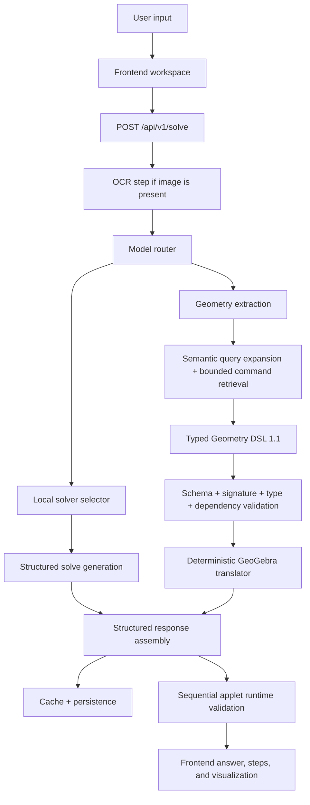

# IntoMath Architecture

## Design goals

IntoMath is designed as a visual learning product, not a chatbot wrapper.

Core architectural goals:

1. **Structured outputs over free-form prose**
2. **Model-generated visualization plans with deterministic validation**
3. **Configurable model routing**
4. **Focused solver UX**
5. **Fast feedback with caching and useful deterministic local solving**

## System overview


```mermaid
flowchart TD
    A[User input] --> B[Frontend workspace]
    B --> C[POST /api/v1/solve]
    C --> D[OCR step if image is present]
    D --> E[Model router]
    E --> L[Local solver selector]
    L --> F[Structured solve generation]
    E --> G[Geometry extraction]
    G --> H[Semantic query expansion + bounded command retrieval]
    H --> I[Typed Geometry DSL 1.1]
    I --> V[Schema + signature + type + dependency validation]
    V --> T[Deterministic GeoGebra translator]
    F --> J[Structured response assembly]
    T --> J
    J --> K[Cache + persistence]
    J --> R[Sequential applet runtime validation]
    R --> U[Frontend answer, steps, and visualization]
```

## Frontend architecture

### App Router structure

- `frontend/app/(marketing)`
  - landing experience
- `frontend/app/(dashboard)`
  - focused solver shell
  - solve page
  - unfinished legacy dashboard routes redirect to the solver

### Key frontend modules

- `components/marketing/landing-page.tsx`
  - focused product homepage
- `components/dashboard/solve-workspace.tsx`
  - two-column solver workspace
- `components/visualization/geogebra-applet.tsx`
  - lazy GeoGebra loader + per-command execution/error UI
- `components/visualization/geogebra-runtime.ts`
  - testable sequential execution, rollback, perspective, style, viewport, and interaction operations
- `features/solver/hooks/use-solve-problem.ts`
  - React Query mutation for solve requests
- `stores/solve-workspace.ts`
  - Zustand state for prompt, upload payload, and learning mode
- `lib/api-client.ts`
  - frontend API transport helper

### UX principles implemented

- solver-first rather than chat-first
- honest capability language rather than AI-brand theatrics
- solution steps split into digestible cards
- confidence shown lightly without routing clutter
- visualization loaded lazily to protect initial performance

## Backend architecture

### API layer

- `app/main.py`
  - FastAPI app setup
  - CORS middleware
  - startup table creation
- `app/api/v1/endpoints/solve.py`
  - `POST /api/v1/solve`
- `app/api/v1/endpoints/health.py`
  - health endpoint

### Service layer

- `solver_service.py`
  - main orchestration layer
  - OCR
  - routing
  - solving
  - visualization extraction
  - translation
  - persistence
  - response caching
- `model_router.py`
  - schema-constrained local-AI classification of subject, difficulty, and visualization environment
  - explicit unclassified route when the model is unavailable or invalid
- `local_solver_selector.py`
  - lets the local llama.cpp model select and normalize a narrow deterministic execution tool
  - never sends geometry through the pre-model deterministic path
- `ocr_service.py`
  - image-to-structured-text stage through local DeepSeek OCR
- `geometry_extractor.py`
  - validated, schema-constrained DSL extraction through the local llama.cpp model for local solve routes
  - remote model extraction for model-backed geometry routes
  - tiny-model semantic catalog query expansion, bounded to 10 retrieved commands
  - returns no visualization when every model-backed parser fails
- `geogebra_translator.py`
  - deterministic DSL → GeoGebra translation
- `geogebra_command_registry.py`
  - cached overload registry, progressive signature normalization, generated capability metadata, and bounded retrieval
- `geogebra_validator.py`
  - label/type/environment/allowlist/dependency validation and topological ordering
- `fallback_solver.py`
  - deterministic execution for AI-selected arithmetic/algebra shapes and last-resort solve fallback
- `cache.py`
  - in-memory TTL response cache

## Routing architecture

The local tiny model classifies prompts into:

- `arithmetic`
- `algebra`
- `number_theory`
- `geometry`
- `trigonometry`
- `calculus`
- `statistics`
- `probability`
- `general`

It selects difficulty and visualization environment in the same constrained JSON
response. If that response is unavailable or invalid, routing remains explicitly
`general`/`medium` with no visualization environment; backend keywords do not guess
the missing classification.

### Model policy

| Use case | Model / route |
|---|---|
| AI-selected arithmetic, linear equations, and quadratic graph analysis | `local:deterministic-solver`; exact parsing is an execution gate after AI selection |
| Local semantic routing, normalization, trivia, catalog-query expansion, and schema-constrained visualization extraction | `unsloth/LFM2.5-8B-A1B-GGUF:Q4_K_XL` via llama-server; deterministic validation remains authoritative |
| Easy algebra / arithmetic outside deterministic coverage | `openai/gpt-oss-20b` via NVIDIA NIM |
| Hard geometry / proofs / multi-step reasoning | `openai/gpt-oss-120b` via NVIDIA NIM |
| Model fallback | NVIDIA NIM order: gpt-oss-120b → gpt-oss-20b, with bounded reasoning and deterministic post-validation |
| OCR / image extraction | `deepseek-ai/deepseek-ocr-2` locally |

Structured-solve fallback order is explicit: the preferred and alternate NVIDIA NIM
gpt-oss models. Geometry uses the same entries after the local llama safety net.

## GeoGebra trust boundary

The production flow is:

```text
prompt
→ local model selects problem type, difficulty, and visualization environment
→ model-selected `none` returns without retrieval or DSL extraction
→ tiny-model semantic query expansion
→ bounded catalog retrieval (10 command names)
→ model emits typed DSL
→ Pydantic schema validation
→ retrieved-command/signature/type/environment validation
→ at most one action-scoped remote repair and full re-validation
→ dependency graph + stable topological ordering
→ deterministic backend translation
→ sequential frontend evalCommand validation
→ interactive rendering
```

The model describes intent. It does not emit construction strings, scripts, or
JavaScript. The backend is the only component that creates GeoGebra command
syntax. Applet styling and view changes are separate typed API calls.

Visualization-environment classification comes from the router model. Command
capabilities come from generated manual-category families, not command-name lists.
The validator separately rejects point-only plans whose coordinates merely reproduce
answer tuples absent from the normalized problem statement.

Remote solve and geometry requests include strict response schemas in their prompts and
validate responses locally. Provider/schema unavailability is distinct from invalid
model output. Geometry falls through to the constrained local parser and the explicitly
named NVIDIA NIM models. If no model returns a valid plan, visualization stays empty. The
published closed NVIDIA `ChatRequest` schemas for these models omit `response_format`,
so non-streaming output is explicitly treated as an unenforced proposal. gpt-oss uses
low reasoning effort. The same authoritative payload,
semantic, dependency, type, and allowlist validators run for every provider.

## Geometry DSL `1.1`

The DSL schema is defined in `backend/app/schemas/geometry_dsl.py`.

### Example

```json
{
  "version": "1.1",
  "space": "euclidean_2d",
  "environment": "geometry_2d",
  "actions": [
    {
      "action": "CREATE_POINT",
      "label": "A",
      "coordinates": [0, 0]
    },
    {
      "action": "CREATE_POINT",
      "label": "B",
      "coordinates": [4, 0]
    },
    {
      "action": "EXECUTE_COMMAND",
      "output": "l1",
      "command": "Line",
      "arguments": [
        {"kind": "reference", "value": "A"},
        {"kind": "reference", "value": "B"}
      ]
    }
  ],
  "render_hints": {}
}
```

### Supported actions

- `CREATE_POINT`
- `CREATE_LINE`
- `CREATE_CIRCLE`
- `CREATE_POLYGON`
- `INTERSECT`
- `MIDPOINT`
- `PERPENDICULAR`
- `PARALLEL`
- `ANGLE_BISECTOR`
- `CREATE_FUNCTION`
- `DEFINE_OBJECT`
- `EXECUTE_COMMAND`

DSL `1.1` is the sole accepted visualization format. It supports the existing
high-level action fields, `DEFINE_OBJECT`, and `EXECUTE_COMMAND`; the latter's output label is
deliberately distinct from command arguments and from `label` on high-level
actions. Generic commands may omit `output` only for a terminal result that will
not be referenced later. The validator emits `untracked_output` as a warning,
and GeoGebra may assign its own label.

Typed generic arguments are `reference`, `number`, `angle`, `point`, `vector`,
`text`, `boolean`, `expression`, `equation`, `list`, and `interval`. Every kind
has a deterministic serializer. Expressions use a small mathematical grammar;
object dependencies must use `reference`, not identifiers hidden inside an
expression.

`DEFINE_OBJECT` covers safe definitions that are not command calls. It carries
`output`, `object_type`, and one typed `value`; for example, a function uses an
equation value such as `f(x) = x^2`. It is preferred for new definitions and can
eventually subsume specialized definition actions. `CREATE_FUNCTION` remains
accepted for DSL 1.1 compatibility.

### Environments and perspectives

The schema represents `geometry_2d`, `graphing`, `graphics_3d`, `cas`,
`probability`, `statistics`, and `spreadsheet`. The frontend uses the documented
GeoGebra Classic standard perspectives: geometry `2`, algebra/graphics `1`,
spreadsheet `3`, CAS `4`, 3D `5`, and probability/statistics `6`.

This is a capability model, not a universal acceptance claim. The existing
high-level actions and generic definitions remain available. All 933 overloads
belonging to the 434 non-blocked command names are runtime-eligible in their
classified environments, including graphing, statistics/probability, 3D, CAS,
and spreadsheet. Four overloads currently have checked-in browser acceptance
evidence; the rest remain honestly labeled experimental and rely on runtime
rejection handling.

## Command registry and discovery

`backend/geogebra_commands.json` contains 502 names and 1,052 overloads from a
pinned upstream commit. The registry:

1. groups duplicate command entries and overloads case-insensitively;
2. retains original signatures and marks uncertain normalization;
3. extracts bounded counts, variadic markers, approximate types, categories,
   CAS and special-environment requirements;
4. derives acceptance status and independent runtime eligibility for every
   exact overload;
5. searches exact names, model-expanded semantic terms, categories, descriptions,
   and prompt keywords; and
6. returns accepted or experimental safe overloads, at most 20 command names
   (the extractor currently requests 10).

Only the bounded retrieved names may be emitted. A cataloged command outside
that boundary receives `command_not_retrieved`; an unaccepted overload receives
an `experimental_command` warning, and permanently denied behavior receives
`unsafe_command`/`blocked_command`. Debug solve responses include the bounded
name, score, and supported signatures only when `APP_DEBUG=true`; full prompts
are never returned.

GeoGebra command definitions are derived from the official manual. The manual
is not vendored here:
https://github.com/geogebra/manual/tree/main/en/modules/ROOT/pages/commands

The generator consumes an explicit local checkout or performs an explicit
developer-requested Git fetch. Normal startup, tests, and requests are offline
with respect to the manual.

## Semantic validation and deterministic translation

The validator tracks Point, Line, Segment, Ray, Circle, Conic, Polygon,
Function, Number, Angle, List, Vector, Matrix, Text, Plane, Surface, Solid, and
Unknown. It rejects undefined references, duplicates, cycles, known type/count
mismatches, unsupported environments, unsafe commands, and model-selected
commands outside retrieval. Independent out-of-order actions are sorted before
translation. Uncertain documentation is accepted only where a compatible,
normalized overload provides a safe match.

Validation returns structured issues containing a code, original action index,
command, output label, severity, and message. Any error produces no command
list; SolverService still returns the mathematical solution with warnings.

The serializer formats finite numbers, degree/radian angles, 2D/3D points and
vectors, escaped text, lowercase booleans, equations, bounded recursive lists,
and intervals. It never uses Python `eval` and never interpolates an unchecked
label, command, text, or expression.

## Runtime validation and rendering operations

The frontend calls `evalCommand` once per command and requires a `true` result.
It stops at the first `false`/exception, records the zero-based backend index
and human-facing one-based index, and restores the XML snapshot. If snapshot
restore is unavailable it starts a fresh construction. A failed construction is
never marked ready; retry remounts the applet.

Color, line thickness/style, point size, label/object visibility, fixation, and
caption use structured applet API methods. Coordinate bounds, axes/grid state,
perspective, movable points, and predefined animation state are also API calls.
`useBrowserForJS` is false. No model-generated JavaScript is evaluated.

## Option B: raw command output

Raw model-generated GeoGebra commands are not implemented or enabled. Typed
generic DSL is the production recommendation because it supports signature,
type, dependency, environment, and targeted repair errors before execution.

A future trusted-user/debug experiment would have to be disabled by default;
limit count and length; reject newlines/separators; validate English command
names against the registry; reject scripts, JavaScript, and incompatible
environments; execute one command at a time; and inspect every boolean runtime
result. It must not become the ordinary AI path.

## Security limits

- 40 actions, 16 arguments per command, 32 items per list, nesting depth 3
- 32-character conservative labels and 64-character command names
- finite numbers and coordinates bounded to ±1e9
- expression/equation length 200; text length 500; caption length 120
- newline, semicolon, quote/expression-command, JavaScript URL, and command-name injection rejection
- repeated labels, missing references, cycles, and 2D/3D coordinate mismatch rejection
- explicit deny policy for scripting, command-text execution, destructive state, media/URL, and catalog state-setting commands

## Command-family rollout

Catalog schema `1.4` keeps the GeoGebra manual's overlapping `category` and
`all_categories` fields, adds a stable `families` list and generated
`capabilities`, and records overload-level `support_status`,
`support_requirements`, acceptance-backed output metadata,
`runtime_accepted_environments`, and `runtime_eligible`.
The current families are 2D geometry, transformations, graphing/calculus, 3D,
CAS, statistics, probability, spreadsheet, lists, vector/matrix, discrete math,
financial, logic, optimization, text, scripting, general, and other. Catalog
metadata reports unique command-name and overload counts for each family and
status, and the registry exposes family and support-status queries.

Acceptance is derived per overload. `supported` requires a safely normalized
signature, representable typed arguments, known output type, correct environment
metadata, and an exact runtime-acceptance record. Missing any criterion yields
`experimental`, but safe experimental overloads remain usable. Scripting and
unsafe state/media behavior is `blocked` even if an acceptance record is
accidentally added. The browser checks every command's boolean `evalCommand`
result and rolls the construction back on failure.

For each next family: add capability/output mappings, fixture signatures and
types, retrieval examples, translator cases, and exact applet acceptance
records. The order is transformations and measurements; graphing/calculus;
statistics/probability; 3D; CAS; spreadsheet. Scripting, network/file behavior,
and unsafe state commands are permanently blocked.

## Persistence layer

SQLAlchemy models:

### `problem_attempts`
Stores:
- raw text
- normalized text
- input type
- language
- created timestamp

### `solver_runs`
Stores:
- selected parser / solver / vision models
- problem type
- difficulty
- route reason
- confidence
- cache status
- response status

### `visualization_artifacts`
Stores:
- visualization kind
- DSL JSON
- command JSON
- visualization summary

## Caching

`SolverService` uses a TTL cache keyed by normalized text + request options.

Benefits:
- repeat queries return faster
- repeated local/model solves return faster
- model usage can be reduced for repeated prompts

## Failure strategy

If NVIDIA NIM is unavailable or no API key is configured:
- supported typed problems still solve through deterministic local logic
- configured NVIDIA NIM endpoints provide explicitly named remote solving
- unsupported prompts return a clear limitation message
- warnings are surfaced in the structured response

This keeps the product useful locally without pretending unsupported prompts were solved.
